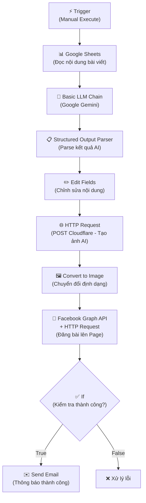
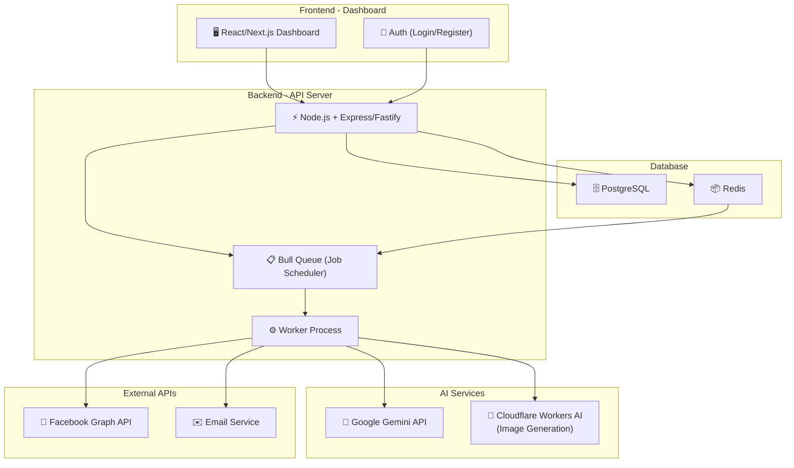
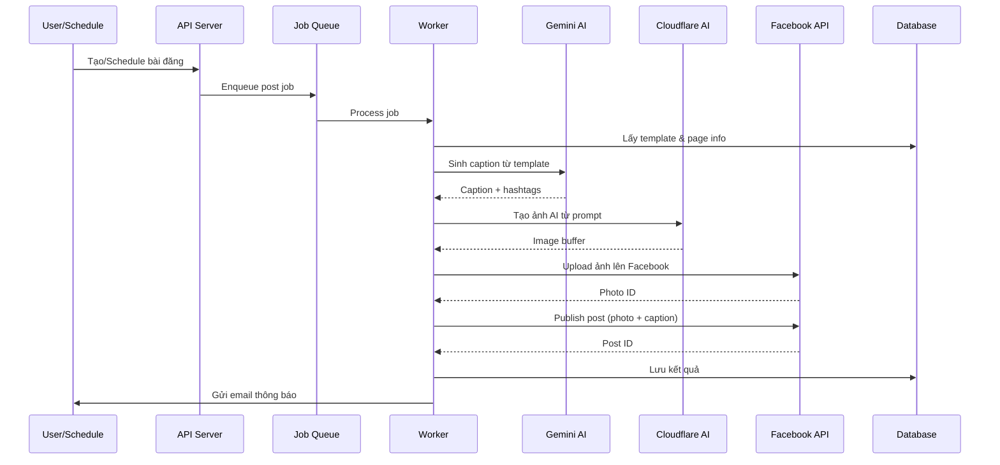

# Auto Post Facebook Page - Web Service SaaS

## 📋 Phân Tích Workflow Hiện Tại (n8n)

Từ hình ảnh workflow n8n, tôi nhận diện được **pipeline 10 bước** sau:

### Chi tiết từng node:

| # | Node | Chức năng | Chi tiết |
|---|------|-----------|----------|
| 1 | **Trigger** | Kích hoạt workflow | Manual click hoặc schedule |
| 2 | **Google Sheets** | Đọc dữ liệu | Lấy rows chứa nội dung bài viết cần đăng |
| 3 | **Basic LLM Chain** | Sinh nội dung AI | Dùng Google Gemini để viết/tối ưu caption |
| 4 | **Structured Output Parser** | Parse output | Chuyển output LLM thành JSON có cấu trúc |
| 5 | **Edit Fields** | Chỉnh sửa | Map và format các trường dữ liệu |
| 6 | **HTTP Request (Cloudflare)** | Tạo ảnh AI | POST đến Cloudflare Workers AI để generate ảnh |
| 7 | **Convert to Image** | Xử lý ảnh | Chuyển đổi response thành file ảnh |
| 8 | **Facebook Graph API** | Đăng bài | Upload ảnh + caption lên Facebook Page |
| 9 | **If (Condition)** | Kiểm tra | Kiểm tra response thành công/thất bại |
| 10 | **Gmail** | Thông báo | Gửi email kết quả đăng bài |

---

## 🎯 Đánh Giá & Phân Tích Kinh Doanh

### Điểm mạnh của ý tưởng
- ✅ **Nhu cầu thị trường lớn**: SME Việt Nam cần tự động hóa social media
- ✅ **Tiết kiệm chi phí**: Thay thế nhân sự content marketing
- ✅ **AI-powered**: Tạo nội dung + hình ảnh tự động, xu hướng 2026
- ✅ **Multi-tenant**: Có thể bán cho nhiều doanh nghiệp

### Hạn chế của n8n workflow hiện tại (KHÔNG phù hợp bán SaaS)

| Vấn đề | Giải thích |
|---------|-----------|
| ❌ **Không multi-tenant** | n8n chạy single instance, không phân biệt khách hàng |
| ❌ **Không có UI quản trị** | Khách hàng không thể tự quản lý |
| ❌ **Không billing/subscription** | Không thu phí tự động |
| ❌ **Bảo mật yếu** | Token Facebook lưu trực tiếp trong workflow |
| ❌ **Không scalable** | Khó mở rộng khi có nhiều khách hàng |
| ❌ **Không có lịch sử** | Không tracking bài đăng, analytics |

---

## 🏗️ Kiến Trúc Web Service Đề Xuất

### Architecture Overview

### Tech Stack đề xuất

| Layer | Technology | Lý do |
|-------|-----------|-------|
| **Frontend** | Next.js 15 + React | SSR, SEO, dashboard |
| **Backend** | Node.js + Fastify | Performance, TypeScript |
| **Database** | PostgreSQL + Prisma | Reliable, ORM mạnh |
| **Queue** | BullMQ + Redis | Job scheduling, retry |
| **Auth** | JWT + OAuth2 | Facebook OAuth login |
| **AI** | Google Gemini API | Content generation |
| **Image** | Cloudflare Workers AI | Image generation |
| **Deploy** | Docker + VPS | Cost-effective |

---

## 📦 Proposed Changes - Chi Tiết Module

### 1. Database Schema

#### [NEW] `prisma/schema.prisma`

Các bảng chính:
- **User** - Thông tin người dùng/doanh nghiệp
- **Subscription** - Gói dịch vụ (Free/Pro/Enterprise)
- **FacebookPage** - Kết nối Facebook Pages
- **ContentTemplate** - Mẫu nội dung (thay thế Google Sheets)
- **Post** - Bài đăng đã tạo
- **PostSchedule** - Lịch đăng bài
- **PostLog** - Lịch sử đăng bài (thành công/thất bại)

---

### 2. Backend API

#### [NEW] `src/server.ts` - Main server entry point
#### [NEW] `src/routes/` - API routes

| Route | Method | Chức năng |
|-------|--------|-----------|
| `/api/auth/register` | POST | Đăng ký tài khoản |
| `/api/auth/login` | POST | Đăng nhập |
| `/api/auth/facebook` | GET | OAuth Facebook |
| `/api/pages` | GET/POST | Quản lý Facebook Pages |
| `/api/templates` | CRUD | Quản lý mẫu nội dung |
| `/api/posts` | CRUD | Quản lý bài đăng |
| `/api/posts/:id/generate` | POST | AI sinh nội dung |
| `/api/posts/:id/publish` | POST | Đăng bài ngay |
| `/api/schedules` | CRUD | Quản lý lịch đăng |
| `/api/analytics` | GET | Thống kê & báo cáo |

#### [NEW] `src/services/` - Business logic

| Service | Chức năng |
|---------|-----------|
| `ai.service.ts` | Gọi Gemini API, sinh nội dung |
| `image.service.ts` | Gọi Cloudflare Workers AI, tạo ảnh |
| `facebook.service.ts` | Quản lý Facebook Graph API |
| `scheduler.service.ts` | Quản lý job queue, cron |
| `email.service.ts` | Gửi thông báo email |

#### [NEW] `src/workers/` - Background workers

| Worker | Chức năng |
|--------|-----------|
| `post.worker.ts` | Xử lý pipeline đăng bài |
| `scheduler.worker.ts` | Chạy scheduled posts |

---

### 3. Post Pipeline (Core Logic)

Pipeline tương đương workflow n8n của bạn, nhưng trong code:

---

### 4. Frontend Dashboard

#### [NEW] Các trang chính:

| Trang | Chức năng |
|-------|-----------|
| `/login` | Đăng nhập/Đăng ký |
| `/dashboard` | Tổng quan, thống kê |
| `/pages` | Quản lý Facebook Pages đã kết nối |
| `/templates` | Quản lý mẫu nội dung |
| `/posts` | Danh sách bài đăng, tạo mới |
| `/posts/create` | Tạo bài đăng mới với AI |
| `/schedule` | Quản lý lịch đăng bài |
| `/analytics` | Báo cáo chi tiết |
| `/settings` | Cài đặt tài khoản, API keys |

---

## 🚀 Mới: Cập nhật luồng Tạo Bài Đăng (Theo yêu cầu mới nhất)

**Mục tiêu**: Cho phép nhập từ khoá nhanh (VD: "Góc nội dung: Giao việc cho AI") để AI tự sinh content + prompt ảnh, VÀ cho phép upload ảnh từ local.

### Thay đổi Backend
1. **`POST /api/posts/:id/generate`**: Sửa logic để chấp nhận `prompt` trực tiếp từ client nếu không dùng `templateId`. Nó sẽ gọi thẳng Gemini API với câu lệnh của user. (Gemini hiện tại đã được config trả về cả `caption` và `imagePrompt`).
2. **`POST /api/posts/:id/upload-image`**: Thêm endpoint mới hỗ trợ upload file ảnh (dùng `multer` lưu tạm vào server hoặc Cloudinary) và cập nhật trường `imageUrl` của Post.

### Thay đổi Frontend (`CreatePostPage.tsx`)
1. **Bước 1 (Chọn Page & Nhập chủ đề)**: 
   - Thêm ô nhập liệu "Chủ đề / Từ khoá tự do". Nếu người dùng nhập vào đây, không cần chọn Template.
2. **Bước 3 (Hình ảnh)**:
   - Thêm nút Toggle/Tab: "AI Tạo Ảnh" vs "Tải Ảnh Lên".
   - Nếu chọn "Tải Ảnh Lên", hiển thị `<input type="file" />`. Ảnh sau khi upload sẽ được hiển thị ở phần Xem trước và gán URL vào Post.

### Pipeline Worker (`post.worker.ts`)
- Logic hiện tại đã hỗ trợ: Nếu `post.imageUrl` đã có (do user upload), worker sẽ bỏ qua bước sinh ảnh AI (Cloudflare/DALL-E) và dùng ảnh đó để đăng lên Facebook. Không cần sửa thêm.

---

## 💰 Mô Hình Kinh Doanh Đề Xuất

| Gói | Giá/tháng | Giới hạn |
|-----|-----------|----------|
| **Free** | 0đ | 1 Page, 10 bài/tháng, không schedule |
| **Pro** | 299K | 3 Pages, 100 bài/tháng, schedule, analytics |
| **Business** | 799K | 10 Pages, unlimited, priority support |
| **Enterprise** | Custom | White-label, API access, dedicated support |

---

## User Decisions & Constraints (Dựa trên phản hồi)

1. **Database**: Chuyển sang sử dụng **MariaDB** thay vì PostgreSQL.
2. **AI Provider**: Sẽ hỗ trợ thêm **OpenAI** và **Claude** bên cạnh Google Gemini.
3. **Image Generation**: Bổ sung thêm các option (như DALL-E, Midjourney) vào phần cấu hình để người dùng có thể tự chọn, không cố định Cloudflare Workers AI.
4. **Authentication**: Tạm thời **bỏ qua bước đăng nhập**, vào thẳng Dashboard. OAuth/JWT sẽ làm sau.
5. **Hosting target**: Sẽ triển khai lên **Hostinger**.
6. **Facebook App**: Đã có sẵn App ID và App Secret.
7. **Input Source**: Sử dụng Form trên Frontend lưu vào Database, **không dùng Google Sheets**.
8. **Billing**: Tạm thời chưa cần tích hợp thanh toán (MVP).
9. **Timeline**: Hoàn thành MVP trong **1 tuần**.
10. **Domain/Server**: Đã có sẵn.

---

## Verification Plan

### Automated Tests
- Unit tests cho từng service (AI, Facebook, Scheduler)
- Integration tests cho pipeline đăng bài end-to-end
- API tests cho tất cả endpoints

### Manual Verification
- Test đăng bài thực tế lên Facebook Page sandbox
- Test schedule đăng bài theo giờ
- Test AI content generation quality
- Load test với nhiều concurrent jobs
